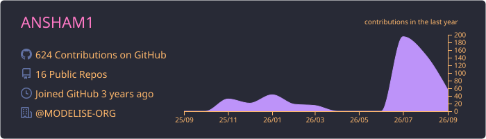

## ANSHAM MAURYA
### AI Systems Engineer  •  Agentic AI  •  Backend & Distributed Systems  •  Deep Learning
#
#### Building AI Systems, exploring distributed architectures, and turning ambitious ideas into production-ready software.

-  I build daily with: `[.py]` • `[.cpp]` • `[.sql]` • `[.git]` • `[.docker]`
-  I'm mostly active within **AI Systems**, **Backend Engineering**, and **Agentic AI**
-  Built: **TorchLessCUDA**, **InsertionAI**, **SentinelAI** **...**
-  **`ping`** me about **AI**, **LLMs**, **System Design**, **Backend Engineering**, **Distributed Systems**, and **Software Architecture**
#

**Languages**  
`Python` • `C++` • `Rust` • `Java` • `JavaScript`

**AI / Machine Learning**  
`PyTorch` • `Keras` • `NumPy` • `Pandas` • `CUDA` • `DeepLearning - ANN, RNN, LSTM, CNN, Transformers`

**LLM / Agentic AI**  
`LangChain` • `LangGraph` • `RAG` • `AI Agents` • `Tool Calling` • `Prompt Engineering` • `Vector Databases`

**Backend Development**  
`FastAPI` • `gRPC` • `REST APIs` • `Node.js` • `Express.js` •  `Microservices` • `Async Programming`

**Databases**  
`Microsoft SQL Server` • `PostgreSQL` • `MySQL` • `MongoDB` • `SQLite`

**DevOps / Infrastructure**  
`Git` • `Github` • `Docker` • `Docker Compose` • `Redis` • `Linux` • `Temporal`
#

  
  

  
  
  

#

  <i>“Chaos is the default state of the universe; every clean line of architecture is a deliberate act of defiance.”</i>

